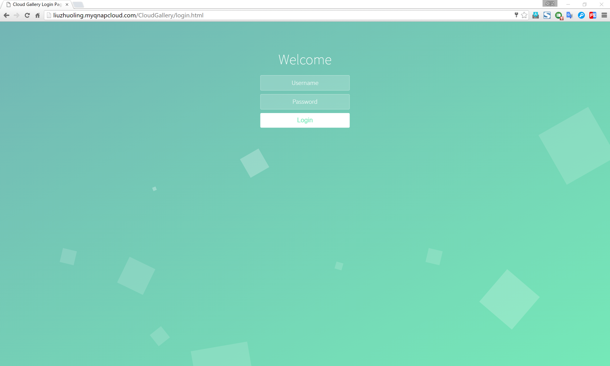
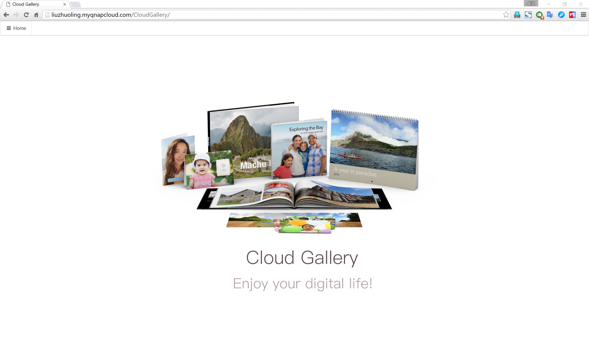
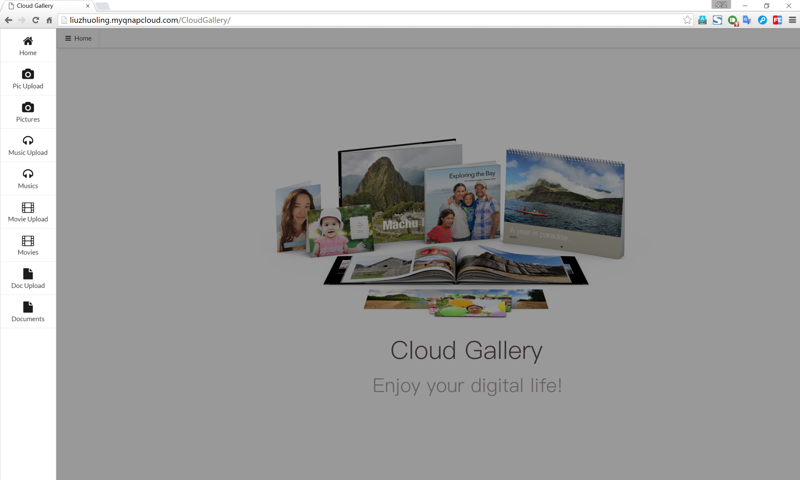
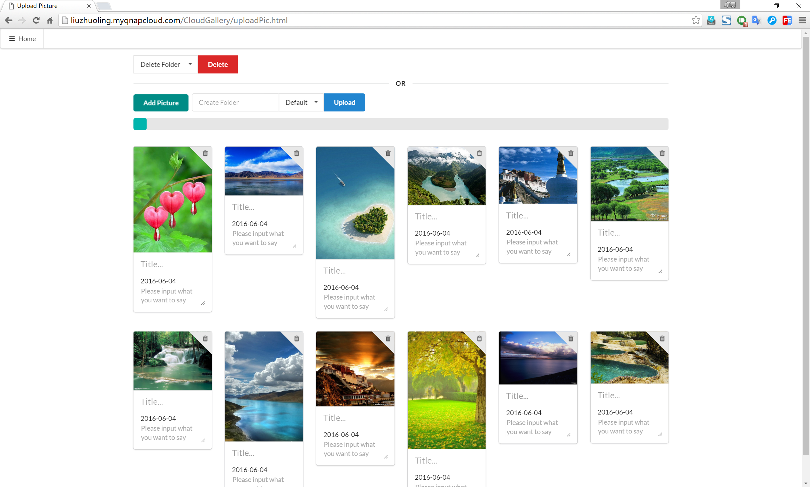
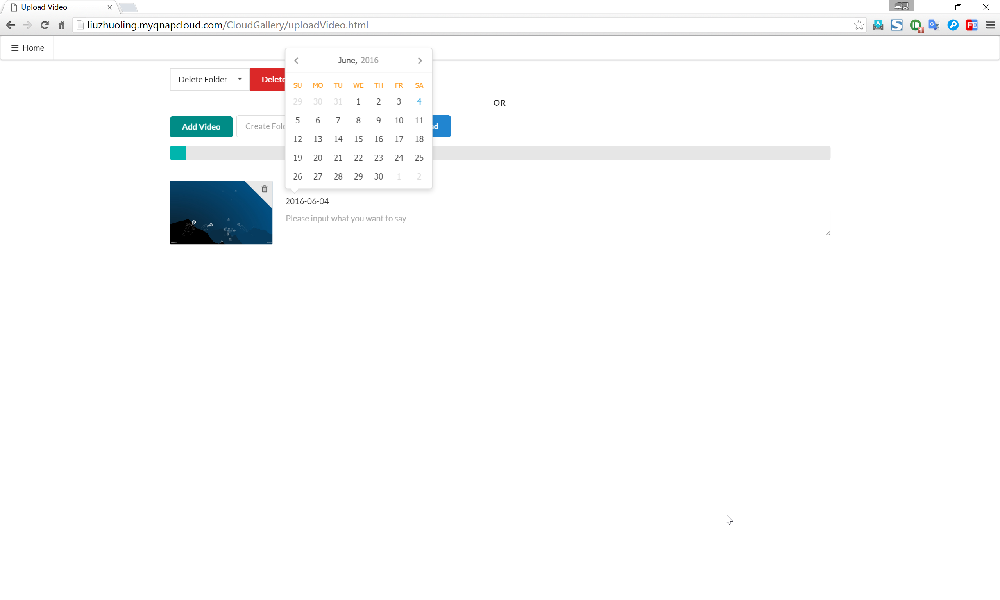
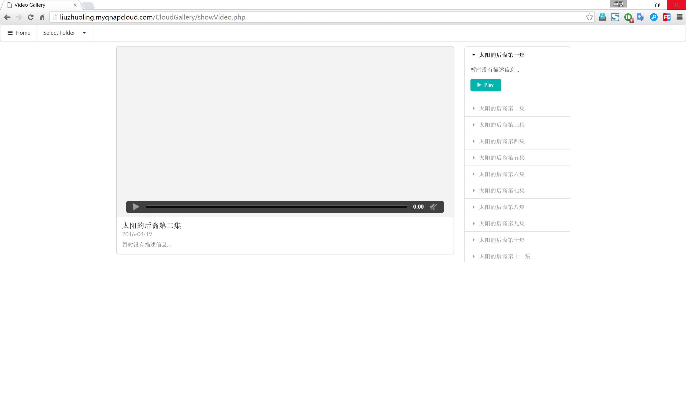
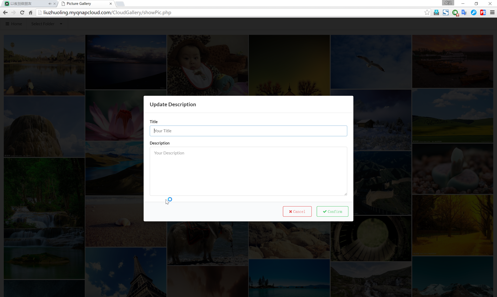

#CloudGallery

记得设置php.ini:    memory_limit = 2048M ;
                    upload_max_filesize = 4096M
                    max_file_uploads = 300
记得将Upload文件夹的权限修改好

Youtube: https://www.youtube.com/watch?v=VCoIRv6T--Q
腾讯视频: http://v.qq.com/page/m/8/0/m0304bf0p80.html

这是我第一次发布自己的代码，站在巨人的肩膀上感觉真好
